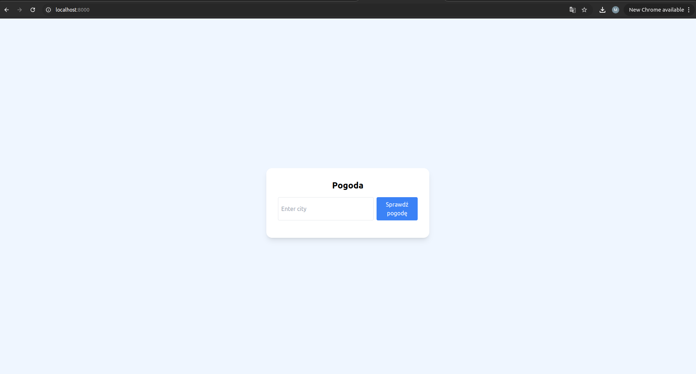
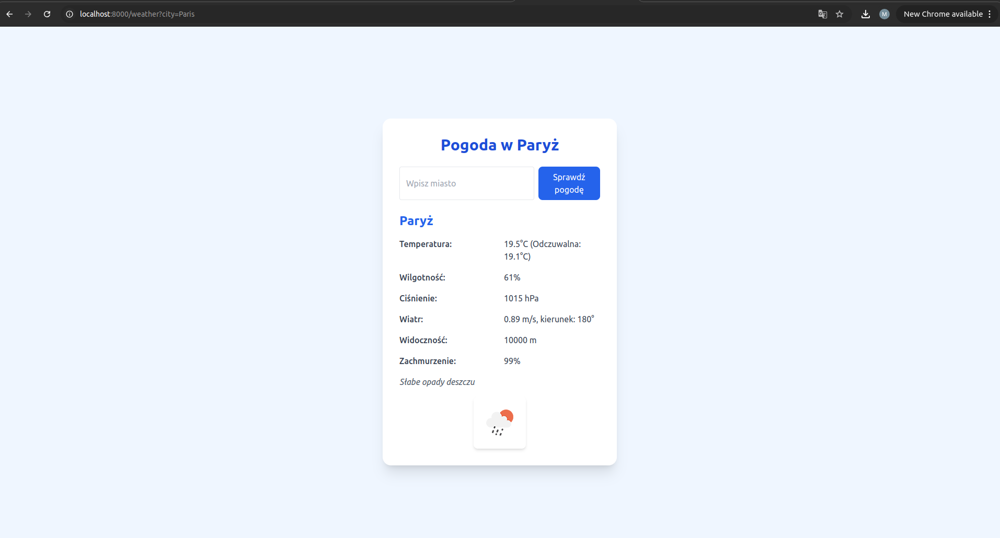
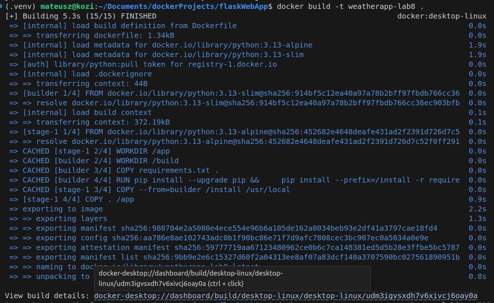
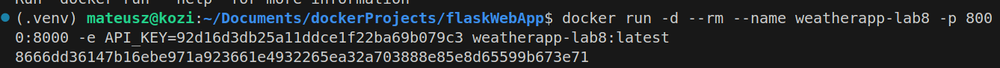
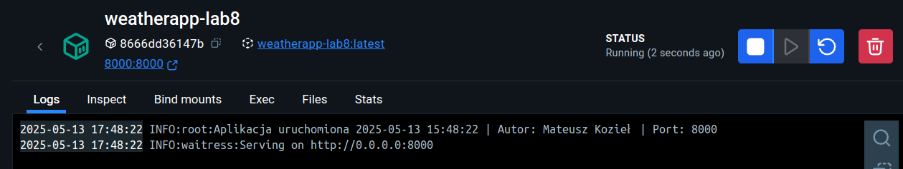
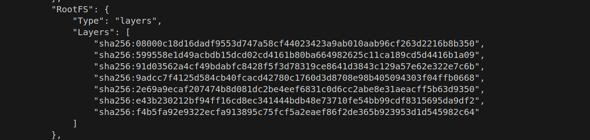

# weatherapp-lab8

## Opis projektu

Aplikacja pokazująca pogodę w dowolnym mieście na świecie




---

## Instrukcja użytkowania

### a.

Aby zbudować obraz kontenera, należy użyć poniższego polecenia:

```bash
docker build -t weatherapp-lab8 .
```


### b. 

aby uruchomić kontener na podstawie zbudowanego obrazu należy użyć polecenia:

```bash
docker run -d --rm --name weatherapp-lab8 -p 8000:8000 -e API_KEY=92d16d3db25a11ddce1f22ba69b079c3 weatherapp-lab8:latest
```


### c. 

aby uzyskać logi należy użyć polecenia:

```bash
docker logs weatherapp-lab8
```


### d. 

aby sprawdzić warstwy obrazu należy użyć polecenia:

```bash
docker image inspect weatherapp-lab8
```

