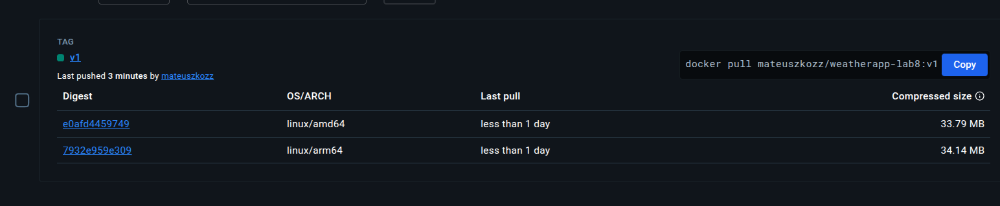
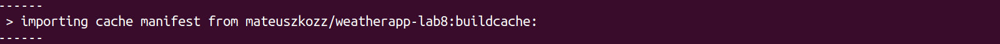

# Część obowiązkowa

### Budowanie obrazu z cache i eksportem do rejestru

```bash
docker buildx build \
  --builder mybuilder \
  --platform linux/amd64,linux/arm64 \
  --tag mateuszkozz/weatherapp-lab8:v1 \
  --push \
  --cache-to=type=registry,ref=mateuszkozz/weatherapp-lab8:buildcache,mode=max \
  --cache-from=type=registry,ref=mateuszkozz/weatherapp-lab8:buildcache \
```
Deklaracja znaduje się poniżej i pokazuje, że obraz jest dostępny dla dwóch platform. Zastosowany został builder ze sterownikiem docker-container


